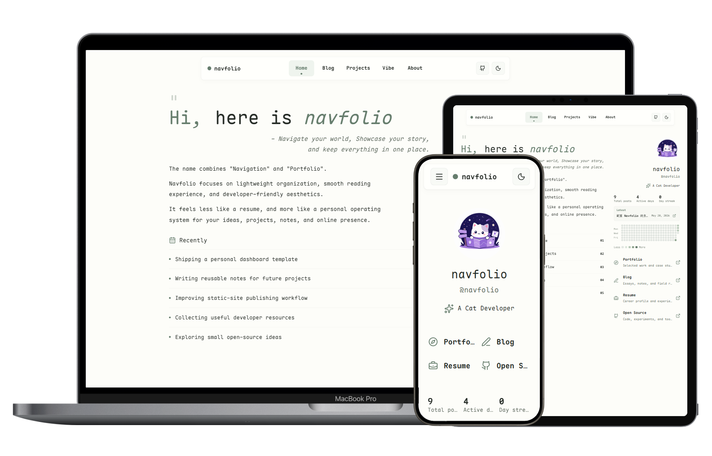

<p align="center">
  
</p>

<p align="center">
  A quiet Astro starter for a personal publishing space: homepage, blog, project notes, Vibe fragments, full-text search, comments, and theme palettes in one maintainable static site.
  <br />
  <sub>Built for writing-first personal websites with restrained visuals, lightweight interaction, and Markdown / MDX content management.</sub>
</p>

<p align="center">
  <a href="./README.en.md">English</a>
  ·
  <a href="./README.md">简体中文</a>
  ·
  <a href="https://astro.navfolio.site/">Live site</a>
  ·
  <a href="https://astro.navfolio.site/blog/">Module guides</a>
</p>

<p align="center">
  
</p>

_Preview image made with @Lruihao's [device preview page](https://github.com/Lruihao/vue-el-demo)._

## What Navfolio Is

Navfolio combines navigation, portfolio, blog, project documentation, and a lightweight digital garden into a single Astro static site. It is not a resume page and not just a blog archive; it is a publishing system that can grow with your notes, projects, and public identity.

- The homepage explains who you are, what you are doing, and where people can find you.
- Blog stores long-form writing, tutorials, project notes, and module guides.
- Projects stores project documentation and work notes.
- Vibe stores shorter life fragments and development logs.
- About introduces the site, the author, and friend links.

Useful links:

- Homepage: https://astro.navfolio.site/
- Blog archive: https://astro.navfolio.site/blog/
- GitHub repository: https://github.com/dodolalorc/astro-navfolio

## Quick Start

### Prerequisites

In addition to Bun and Git, production builds **require Python 3, FontTools, and Brotli**. `bun run build` generates a WOFF2 font subset from the CJK characters used by the UI and content, and fails if those tools are unavailable.

Install the Python tools in a project-local virtual environment. You do not need to activate it: Navfolio's build script automatically prefers `.venv`.

macOS / Linux:

```sh
python3 -m venv .venv
.venv/bin/python -m pip install --upgrade pip fonttools brotli
```

Windows (PowerShell or Command Prompt):

```powershell
py -3 -m venv .venv
.venv\Scripts\python.exe -m pip install --upgrade pip fonttools brotli
```

Verify the font-subsetting setup with:

```sh
bun run fonts:ui
```

Install dependencies:

```sh
bun install
```

Start the dev server:

```sh
bun run dev
```

Build for production:

```sh
bun run build
```

Preview the production build:

```sh
bun run preview
```

## First Edits

Most personal content can be replaced without editing components. Start here:

```text
src/config/site.toml        Site title, profile, navigation, homepage modules, comments, search, theme
src/content/about.mdx       About page
src/content/blog/           Blog posts and module guides
src/content/projects/       Project shelf and project documents
src/content/vibe/           Short notes and life fragments
public/images/              Logos, avatars, previews, and static images
```

Create content with the built-in scripts:

```sh
bun run post:new my-first-post
bun run post:new my-interactive-post --mdx
bun run project:new my-project
bun run vibe:new today-cloud
bun run media:new my-favourite-book
bun run post:new private-draft src/content/drafts
```

Every page-content script follows
`bun run <page-shorthand>:new <filename> [optional-output-directory]`. The
sanitized filename becomes both the output basename and initial `title`; when
the directory is omitted, the page template's default content directory is
used. `--md`, `--mdx`, or an extension in the filename can override the default
extension. Page packages publish editable defaults in `templates/default.md`;
the Blog default lives in `scripts/templates/post.md`, so frontmatter and
starter content can change without editing TypeScript.

## Routes

```text
/                 Personal dashboard homepage
/blog             Writing archive and module guides
/blog/[slug]      Blog article pages
/projects         Project shelf
/projects/[slug]  Project documentation pages
/vibe             Short-note timeline
/about            About page
/rss.xml          RSS feed
```

## Module Guides

Navfolio's module documentation is written as real blog content under `src/content/blog/`, so it is available both in the repository and on the live blog archive.

| Module                        | Local content                                        | Live guide                                                       |
| ----------------------------- | ---------------------------------------------------- | ---------------------------------------------------------------- |
| Site config and homepage data | `src/content/blog/toml-site-config-guide.md`         | https://astro.navfolio.site/blog/toml-site-config-guide/         |
| Theme palettes                | `src/content/blog/theme-palettes.mdx`                | https://astro.navfolio.site/blog/theme-palettes/                 |
| Full-text search              | `src/content/blog/site-search-module-guide.md`       | https://astro.navfolio.site/blog/site-search-module-guide/       |
| Comments                      | `src/content/blog/add-comment-system-to-navfolio.md` | https://astro.navfolio.site/blog/add-comment-system-to-navfolio/ |
| Vibe notes                    | `src/content/blog/vibe-content-guide.mdx`            | https://astro.navfolio.site/blog/vibe-content-guide/             |
| Categories and series         | `src/content/blog/categories-series-guide.md`        | https://astro.navfolio.site/blog/categories-series-guide/        |
| Friend link cards             | `src/content/blog/friend-link-card.mdx`              | https://astro.navfolio.site/blog/friend-link-card/               |
| Markdown rendering            | `src/content/blog/markdown-style-guide.md`           | https://astro.navfolio.site/blog/markdown-style-guide/           |

## Site Configuration

Site-level data lives in `src/config/site.toml`:

- `[config.site]`: site title, descriptions, repository URL, and footer note.
- `[config.profile]`: author name, handle, role, avatar, website, GitHub, email, and metadata.
- `[[config.topNav.links]]`: top navigation links.
- `[config.theme]`: built-in palette selection.
- `[config.search]`: search entry, shortcut, placeholder, and result count.
- `[config.comments]`: comment switch and provider.
- `[config.vibe]`: Vibe timeline behavior.
- `[config.home]`: homepage quote, introduction, navigation cards, contact links, and current focus list.

The config shape is validated by the Zod schema in `src/content.config.ts`. Missing or invalid fields fail during `bun run build`, which keeps configuration errors easy to locate.

## Content Model

Blog posts, project documents, and the About page share the article schema:

```yaml
title: 'Article title'
description: 'Short summary for archives and metadata.'
date: '2026-05-18'
draft: false
heroImage: '/src/assets/figure/example.png'
showHeroImage: true
tags:
  - Astro
comments: true
sidebar:
  enable: true
  toc: true
  relatedPosts: true
```

`sidebar` controls article utility areas:

- `enable`: toggles the sidebar area.
- `toc`: toggles heading navigation.
- `relatedPosts`: toggles related posts.

Regular blog posts usually benefit from reading tools. `/about` and selected project pages can use a centered no-sidebar layout.

## Search

Navfolio uses Pagefind to generate a static full-text search index. The top navigation search button opens a quiet modal, and `Ctrl+K` / `Cmd+K` opens it from anywhere on the site.

```toml
[config.search]
enabled = true
shortcut = "mod+k"
placeholder = "Search notes..."
maxResults = 6
```

`bun run build` runs Astro first, then writes the Pagefind bundle to `dist/pagefind`. In development, the modal shows an unavailable-index note until a production build has generated the index. Use `bun run preview` after building to test the complete search flow.

## Comments

Navfolio supports configurable comment providers:

- `giscus`
- `utterances`
- `waline`
- `none`

Configure comments in `src/config/site.toml`:

```toml
[config.comments]
enabled = true
provider = "giscus"
show_on_posts = true
```

A single post can disable comments in frontmatter:

```yaml
comments: false
```

## Deployment

The site builds to static files in `dist` and can be deployed to GitHub Pages, Vercel, Netlify, Cloudflare Pages, or any platform that supports Astro static output.

For GitHub Pages project sites, the included workflow can be used directly. `astro.config.mjs` automatically handles the project-page `base` in GitHub Actions, and it can also be overridden manually:

```sh
SITE_URL=https://example.com SITE_BASE=/astro-navfolio bun run build
```

## Project Structure

```text
public/
  images/                 Logos, previews, and static images
src/
  assets/                 Content images and local fonts
  components/
    article/              Article header components
    blog/                 Top nav, search, TOC, and related posts
    cards/                Homepage cards
    comments/             Comment provider components
    layout/               Homepage dashboard layout
    mdx/                  MDX content components
    widgets/              Writing activity and utility widgets
    Icon.astro            Shared icon adapter
  content/
    about.mdx             About page content
    blog/                 Blog Markdown / MDX and module guides
    projects/             Project shelf and project documents
    vibe/                 Short notes
  config/site.toml        Site configuration
  data/site.ts            TOML config loading helper
  layouts/                Base and article layouts
  pages/                  Astro routes
  styles/                 Global theme, palettes, typography, and layout variables
```

## Stack

- Astro 6
- Bun
- Tailwind CSS 4 through Vite
- Pagefind
- `@astrojs/mdx`
- `@astrojs/rss`
- `@astrojs/sitemap`
- `lucide-astro`
- `sharp`

## Design Direction

Navfolio is meant to feel like a calm developer notebook:

- content first;
- soft but structured surfaces;
- restrained shadows and borders;
- readable article rhythm;
- subtle motion;
- no marketing-style landing page;
- no visual noise around long-form reading.

If this starter helps you, a star on the repository is warmly appreciated: <https://github.com/dodolalorc/astro-navfolio>.
